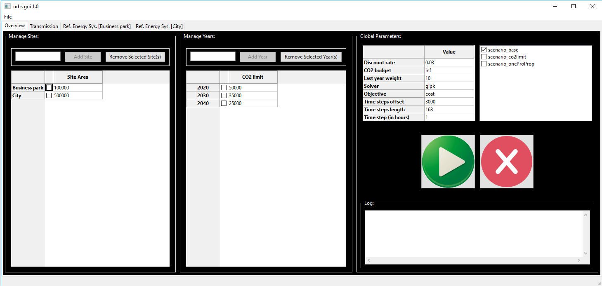
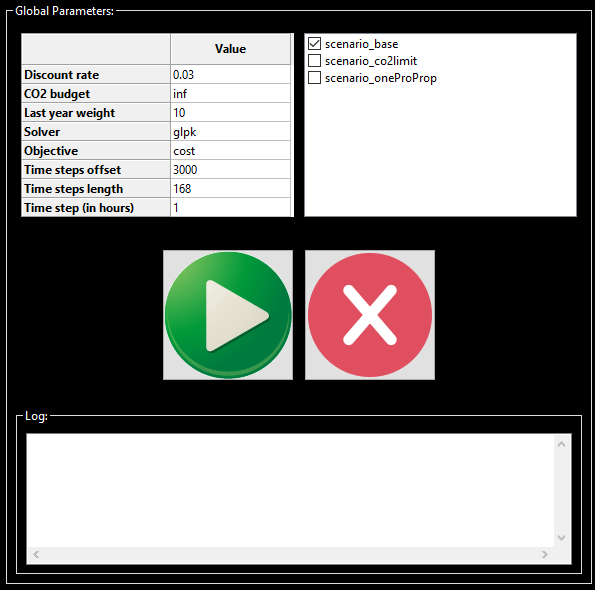

Tab Overview
------------
For the description of the overview tab first the standard example of a
business park and neighbouring ciy will be used. In the end of this page a
small guide for filling out this tab from scratch will be given.

The overview tab for the standard example looks the following:

It is split into 3 main parts, all of which will be presented separately in the
following.

Manage Sites
^^^^^^^^^^^^
In the left hand side the locations (sites) of the
model are specified.

.. image:: img_gui_tutorial/Manage_Sites.png
    :width: 60%
    :align: center

Each location has a designated area. For energy conversion
units a capacity dependent area can bedefined and it is total available area
that is restricted here per site. The area can be specified by clicking in
the text field next to the checkbox and entering the desired number there
('inf' is also possible if no restriction is desired). You can add a new site
by entering its name into the text line next to the *Add Site* button and
clicking it. A site can be removed by first checking the checkbox next to the
site name and then clicking the *Remove Selected Site(s)*
button.

Manage Years
^^^^^^^^^^^^
In the middle part of the overview tab you can manage the desired modeled years
These years are then the support years for the intertemporal modeling. It is
also possible to enter just one year for a non-intertemporal, single year
optimization.

.. image:: img_gui_tutorial/Manage_Years.png
    :width: 60%
    :align: center

For each Year total allowed CO2 emissions can be specified. The energy system
is then only allowed to emit the specified amount of CO2 across all modeled
sites. The allowed annual emissions can be specified by clicking in
the text field next to the checkbox and entering the desired number there
('inf' is also possible if no restriction is desired). You can add a new year
by entering its name into the text line next to the *Add Year* button and
clicking it. A modeled year can be removed by first checking the checkbox next
to the year and then clicking the *Remove Selected Year(s)* button.

Global Parameters
^^^^^^^^^^^^^^^^^
The right hand part of the overview tab is used to specify global parameters.
In addition scenarios can be chosen and the optimization can be started and
supervised.

The global parameters are set in the upper right hand part of the screen
section. They are set by clicking on the field next to the quantity. In all
cases except for *Solver* and *Objective* a number has to be entered. In the
two cases singled out a drop down menu appears which offers the allowed
choices. The parameters are:

* **Discount rate**: This value gives the discount rate that is used for
  intertemporal planning. It stands for the annual devaluation of money across
  the modeling horizon.
* **CO2 budget**: While the *CO2 limit* specified for each year limits the
  CO2 emissions across all sites within one modeled year, the *CO2 budget* sets
  a cap on the total emissions across all sites in the entire modeling horizon.
  If no restriction is desired enter 'inf' here. The *CO2 budget* is only
  active when the *Objective* is set to its default value 'cost'.
* **Cost budget**: With this parameter a limit on the total system cost over
  the entire modeling horizon can be set. If no restriction is desired enter
  'inf' here. The *Cost budget* is only active when the *Objective* is set to
  the value 'CO2'.
* **Last year weight**: In intertemporal modeling each modeled year is repeated
  until the next modeled year is reached. This is done ba assigning a weight to
  the costs accrued in each of the modeled years. For the last modeled year the
  number of repetitions has to be set by the user here, where a high number
  leads to a stronger weighting of the last modeled year, i.e. of the final
  energy system configuration.
* **Solver**: Here you can specify the desired solver. When clicking on the
  field in column 'Value' a drop down menu opens where three solvers *glpk*,
  *gurobi* and *cplex* are listed as options. Note that only *glpk* is an
  open-source free ware for all users and included in the installation package.
  The other two solvers are commercial and have to be bought by the user
  separately.
* **Objective**: Here you can chose which quantity is to be minimized by the
  optimization process. There are currently two options 'cost' (default) and
  'CO2'. You can chose them in a drop down menu that occurs when you click into
  the 'Value' column.
* **Time step offset/length**: The next two global parameters specify which of
  the time steps given as parameters are to be considered by the model. The
  optimization will start at the value 'offset+1' and end at 'offset+length'
* **Time step (in hours)**: Many parameters are given to the model as time
  series. With this global parameter you can specify how long each entry of a
  time series is in hours.

On the top right hand side of this section scenarios can be specified. These
refer to variations in the input parameters which can be specified in functions
in the subfolder 'urbs' in file 'scenarios.py'. A few standard examples are
listed already and can be chosen by chacking the boxes next to their names.

The lower part of this screen section is dedicated to model running and
supervision. With the 'Play' button a model run is started and can be
interrupted with the red 'Stop' button. The lower section displays the log file
of the model run.   